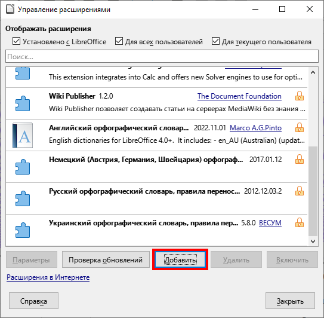

# expansion-Lib3Dfunction
Расширение для ПО LibreOffice построение трёхмерных графиков

Расширение совместимо только с документами LibreOffice Calc и предоставляет функциональность построения трехмерных графиков
+ указания функции
+ указания файла с набором точек
+ указания области на листе со значениями

Для добавления расширения в документы после установки файла с расширение OXT необходимо открыть электронную таблицу LibreOffice Calc, перейти в контекстное меню «Сервис».

Далее необходимо выбрать активное поле «Управление расширениями» или воспользоваться горячими клавишами «Ctrl+Alt+E». Затем будет представлено диалоговое окно «Управления расширениями», в котором необходимо нажать на кнопку «Добавить».

После чего будет вызван файловый менеджер, в котором необходимо выбрать ранее установленное на устройство расширение.

Затем будет предложено перезапустить LibreOffice для вступления изменений в силу, перезапускаем.

Готово, модуль успешно добавлен в электронную таблицу LibreOffice Calc, для начала использования необходимо вызвать макрос нажатием на кнопку.

Более подробную информацию можно найти непосредственно при вызове макроса, поскольку реализовано краткое контекстное руководство
по каждому шагу выполнения макроса, или ознакомиться с выпускной квалификационной работой: "Разработка модуля построения
трехмерных графиков для LibreCalc" Гладкова Александра Андреевича, выпускника Факультета Математики и Компьютерных Наук КубГУ
